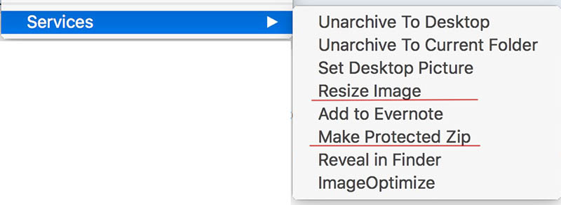

# osx_scripts
OSX scripts and automator services

Note: to install OSX automator workflows / services, check out this repo then double click on the workflow to install it as a service, you can then find it in your normal services menu locations, i.e. when you right click on an item in finder.

* Make Protected Zip.workflow - adds a system service to create a encrypted zip file from selected items in finder.

* Resize Image.workflow - will (batch) resize any number of selected images in finder, keeps the quality around the same but will reduce the dimensions to a value prompted for.

 

